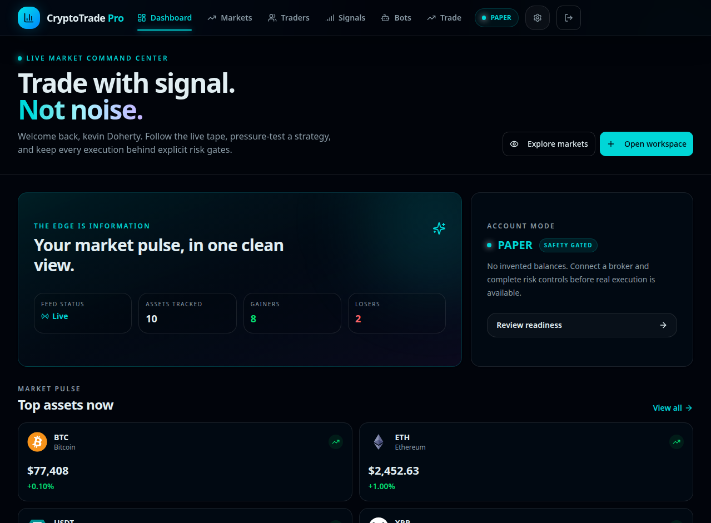

# CryptoTrade Pro

<p align="center">
  
</p>

<p align="center">
  <strong>Trade with signal. Not noise.</strong><br />
  A safety-gated crypto market command center for provider-backed data, persisted paper trading, advisory signals, and controlled execution readiness.
</p>

<p align="center">
  <a href="https://github.com/EdgeAgent/crypto-trade-pro/actions"></a>
  <a href="https://github.com/EdgeAgent/crypto-trade-pro"></a>
  
  
  
  
</p>

> **Safety first:** paper mode is the default. Live order execution remains disabled until a broker connection is independently configured, validated, reconciled, and explicitly confirmed for each order.

## Product preview

<p align="center">
  
</p>

## What this is

CryptoTrade Pro is a mobile-first trading workspace built around live market information and explicit execution boundaries. It combines CoinGecko REST fallback data, resilient Binance market streams, provider-backed OHLC charts, RSI/MACD/Bollinger indicators, a persisted paper ledger, advisory AI signals, staged copy-trading intents, strategy-bot lifecycle controls, risk sizing, and operational audit visibility.

The interface is intentionally designed to show **live, loading, offline, unavailable, or empty** states rather than inventing balances, traders, signals, performance, or execution results.

## Product surface

| Surface | Current behavior |
| --- | --- |
| Dashboard and Markets | Provider-backed quotes with explicit connection and fallback states |
| Trading | Persisted paper funding, market fills, open/editable/cancellable limits, positions, fills, and advisory risk sizing |
| Signals | Structured server-side advisory generation with SSE updates and provider-empty states |
| Traders and Copy | Registry-backed discovery boundary with staged copy intents; no fabricated trader records |
| Bots | Validated strategy configuration with staged, active, paused, and stopped lifecycle states |
| Settings and Risk | Broker placeholders, daily-loss controls, audit activity, and live-readiness disclosures |

## Technology

React 19, TypeScript, Tailwind CSS 4, tRPC 11, Express, Drizzle ORM, MySQL/TiDB, Recharts, Vitest, CoinGecko REST, Binance WebSocket, and the configured server-side LLM proxy.

## Quick start

```bash
pnpm install
pnpm dev
```

For verification:

```bash
pnpm check
pnpm test
pnpm build
node scripts/profile-build.mjs
```

The complete setup, architecture, API, schema, deployment, and troubleshooting references are in [`docs/`](docs/).

## Repository notes

This repository is private and contains no exchange credentials, seeded customer reviews, fabricated trader profiles, or simulated live execution. Configure secrets through the project environment and follow the deployment guide before enabling any real-capital workflow.

## Documentation

- [`docs/USER_GUIDE.md`](docs/USER_GUIDE.md)
- [`docs/DEVELOPER_GUIDE.md`](docs/DEVELOPER_GUIDE.md)
- [`docs/API.md`](docs/API.md)
- [`docs/ARCHITECTURE.md`](docs/ARCHITECTURE.md)
- [`docs/DATABASE_SCHEMA.md`](docs/DATABASE_SCHEMA.md)
- [`docs/DEPLOYMENT_GUIDE.md`](docs/DEPLOYMENT_GUIDE.md)
- [`docs/TROUBLESHOOTING.md`](docs/TROUBLESHOOTING.md)
- [`docs/PERFORMANCE_BASELINE.md`](docs/PERFORMANCE_BASELINE.md)

## Status

The current project snapshot is production-hardened for provider-backed observation, honest paper execution, advisory signal delivery, and safety-gated readiness. Real Binance, Coinbase, and Kraken execution adapters remain typed and disabled by default until credential verification, idempotency, order reconciliation, settlement synchronization, and operational review are complete.
